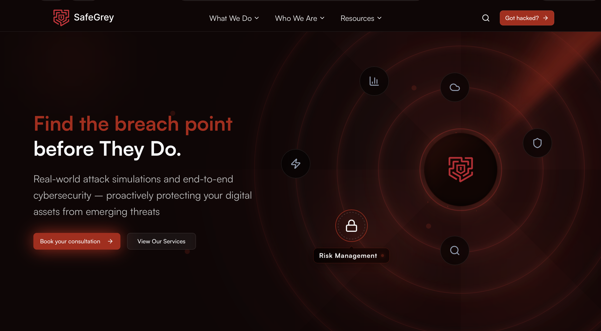
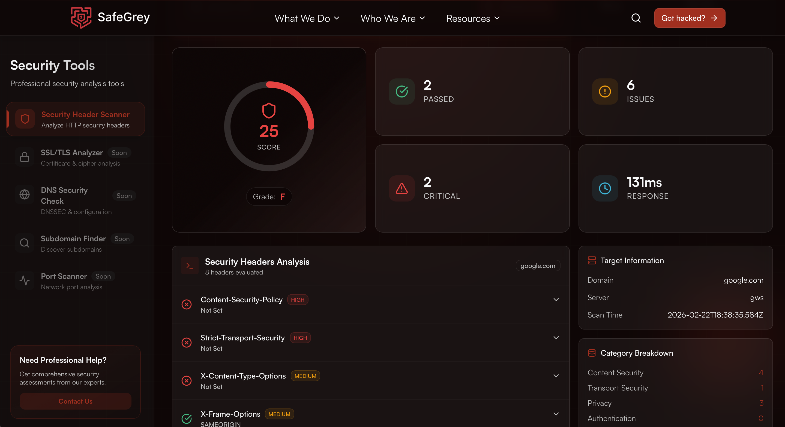
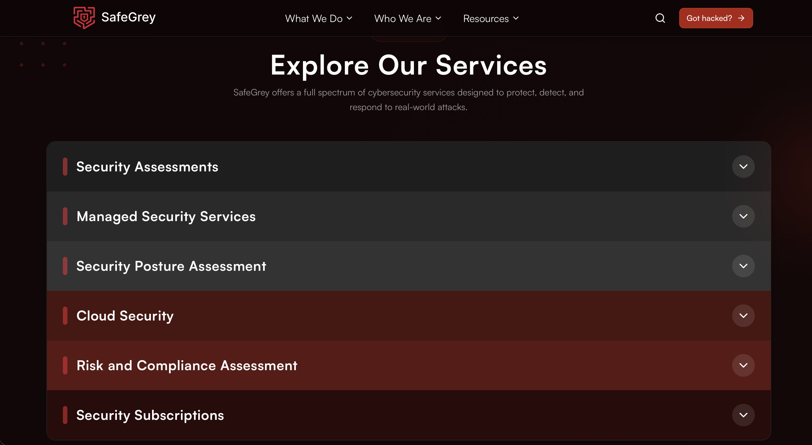
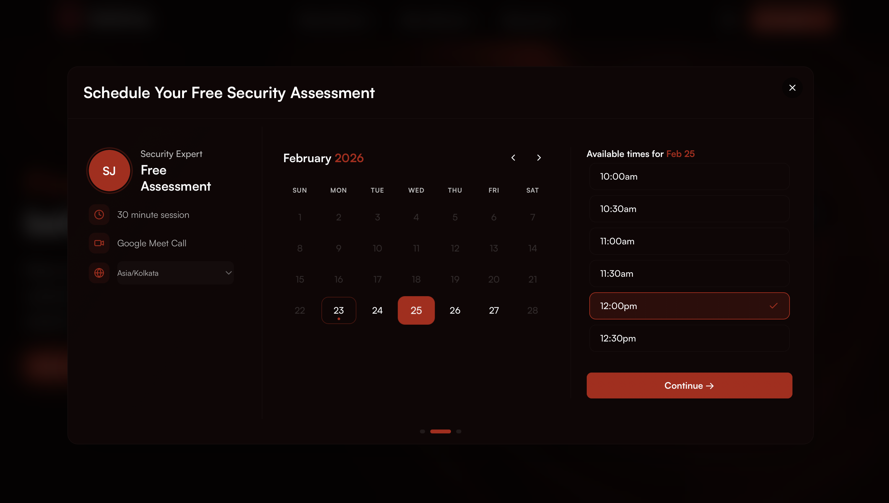

  
  
  <h1>🛡️ SafeGrey (ThreatOps)</h1>
  
<strong>Advanced Threat Operations & Security Solutions. Live at <a href="https://safegrey.com">safegrey.com</a>.</strong>

---

## 📸 Platform Showcase

Here is a glimpse into the platform, featuring our state-of-the-art interface and robust security tools.

### 🏠 Home
The main gateway to SafeGrey, highlighting our proactive cyber defense capabilities.

  

### 🛠️ Tools
A comprehensive suite of cybersecurity tools designed for deep analysis and threat detection.

  

### 💼 Services We Provide
Tailored security services crafted to protect your infrastructure from modern threats.

  

### 📅 Book Your Slots
Seamlessly schedule consultations and security audits with our expert ThreatOps team.

  

---

## 🚀 Tech Stack

SafeGrey is built using a modern, scalable, and highly performant technology stack to ensure seamless user experiences and robust functionality.

| Category | Technologies Built With | Details |
| :--- | :--- | :--- |
| **Core Framework** |   | **Next.js 14** (App Router)   **React 18** |
| **Language** |  | **TypeScript** for strict type safety |
| **Styling & UI** |   | **Tailwind CSS 4**   **Radix UI**/shadcn for accessible UI |
| **Animations & 3D** |    | **Framer Motion**, **GSAP**, **Lenis**   **Three.js** & **Spline** for WebGL depth |
| **Database** |  | **MongoDB** alongside **Mongoose** |
| **AI Integration** |   | **OpenAI Integration**   **Vercel AI SDK** |
| **State & Forms** |   | **React Hook Form**   **Zod** schema validations |

---

## 🌐 Live Platform

Experience the platform live at:
### 👉 **[safegrey.com](https://safegrey.com)**

---

  <i>Developed to bring comprehensive Next-Gen Threat Operations directly into your system.</i>

